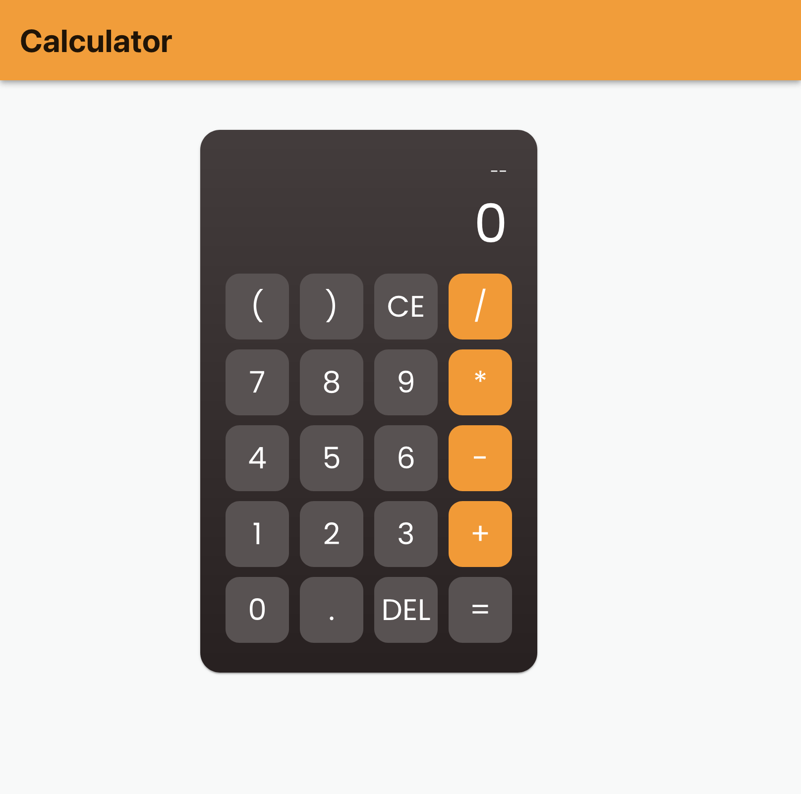
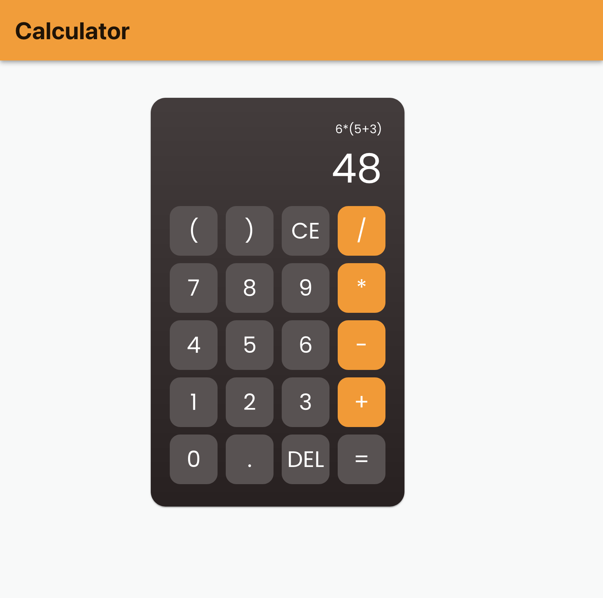

# calculator

## Features supported

- Addition
- Subtraction
- Division
- Multiplication

## steps to run

npm install && npm start

## Pending things to do
- Write unit tests
- Handle invalid expressions gracefully

## screenshots

